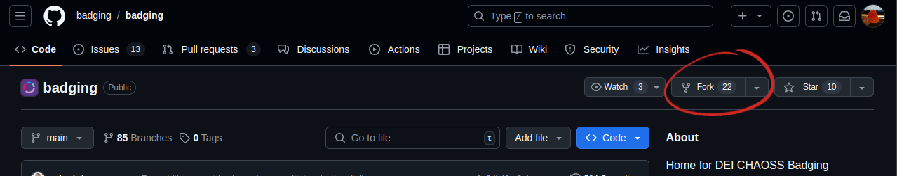

# Contributing to DEI CHAOSS Badging!

👍🎉Thank you for your interest in contributing to DEI CHAOSS Badging! 🎉👍

We are beyond excited to see that you want to contribute! and we welcome all contributions to help make this project even better.
There are many ways in which one could contribute to the DEI CHAOSS Badging and every contribution is equally appreciated.

Before you get started, please take a moment to read through the following guidelines:

- [Code of Conduct](#code-of-conduct)
- [Who can contribute?](#who-can-contribute?)
- [How to Contribute](#how-to-contribute)
  - [Set up your Local Development Environment](#set-up-your-local-development-environment)
- [Code Style and Standards](#code-style-and-standards)

## Code of Conduct

Please note that this project has a [Code of Conduct](/CODE_OF_CONDUCT.md). We expect all contributors to adhere to it. Please take a moment to read through these guidelines to ensure a positive and inclusive contributor experience.

## Who can contribute?

The DEI CHAOSS Badging initiative is built by the community and warmly welcomes collaboration. So anyone can contribute to this project.

## How to Contribute

Here are the steps to follow to contribute to DEI CHAOSS Badging:

1. **Fork the Repository**: Click the "Fork" button in the upper right-hand corner of the [DEI CHAOSS Badging repository](https://github.com/badging/badging) on GitHub.
   

2. **Clone Your Fork**: Clone your fork of the repository to your local machine:

   ```bash
   git clone https://github.com/your_username/badging.git
   ```

   replace `your_username` with your actual github username

### Set up your Local Development Environment

3. **Perform the following to get your working environment ready**:

   ```bash
      cd badging # move into project directory
      npm install # installs packages and dependencies
   ```

4. **Create a Branch**: Create a new branch for your contribution:

   ```bash
   git checkout -b your-branch-name
   ```

5. **Make Changes**: Make your desired changes to the codebase. Ensure your code follows our coding standards and guidelines.

6. **Test**: Test your changes to ensure they work as expected. You may need to create a `.env` file with values from the `.env.example` file. e.g, if you want to connect to an API, create a `.env` file with values as shown below.

   ```bash
      API_BASE_URL = <replace with string of your local or remote api endpoint>
   ```

   once that is done, you can test some of your changes locally in development mode by running;

   ```bash
   npm run dev
   ```

7. **Commit Changes**: Commit your changes with a clear and descriptive message.

   ```bash
   git add .
   git commit -S -m "<Brief description of your changes>"
   ```

8. **Push Changes**: Push your changes to your fork on GitHub:

   ```bash
   git push origin your-branch-name
   ```

9. Create a Pull Request: Go to the ALL In CHAOSS Badging repository on GitHub and create a new pull request from your fork. Describe your changes and why they should be merged.

10. **Review and Discussion**: Your pull request will be reviewed by the maintainers and the community. Be prepared for feedback and be responsive to any suggested changes.

11. **Merge**: Once your pull request is approved, it will be merged into the main project.

## Code Style and Standards

CHAOSS Badging follows a specific code style and coding standards. Please make sure to adhere to these standards when contributing.

### Issue Tracking

If you're looking for ways to contribute but don't have specific code changes in mind, you can check the [issue tracker](https://github.com/badging/badging/issues) for All In CHAOSS Badging on GitHub. You might find issues marked as "help wanted" or "good first issue."

Ask for help
If you have any questions or need assistance with your contribution, please get in touch with any of the following project maintainers:

- [Tochukwu Odeme](https://github.com/Teek-tech)
- [Precious Abubakar](https://github.com/misspee007)
- [Kaxada](https://github.com/kaxada)
- [iyimide adegunloye](https://github.com/mide358)
- [Ruth Ikegah](https://github.com/Ruth-ikegah)
- [Anita Ihuman](https://github.com/Anita-ihuman)
- [Kingsley Mkpandiok](https://github.com/iamkingsleey)

We appreciate your contributions and look forward to working with you to make ALL In CHAOSS Badging even better!

## Community Resources

### Badging

- [Badging Project Documentation](https://github.com/badging/badging/wiki)
- [Badging Website](https://badging.chaoss.community/)
- [Badging Website Design (Figma)](https://www.figma.com/design/BG3gSZL2ukRqtTz5i94CGH/Project-Badging)
- [CHAOSS DEI Project Badging (Blog | chaoss.community)](https://chaoss.community/chaoss-dei-project-badging/)
- [Metrics Model: DEI Event Badging (Blog | chaoss.community)](https://chaoss.community/kb/metrics-model-dei-event-badging/)
- [About CHAOSS DEI Badging (github.com)](https://github.com/badging/badging?tab=readme-ov-file#dei-project-badging)

### CHAOSS

- [Website](https://chaoss.community/)
- [Get Involved](https://chaoss.community/participate)
- [Metrics](https://github.com/chaoss/metrics)
- [Evolution Metrics Working Group](https://github.com/chaoss/wg-evolution)
- [Common Metrics Working Group](https://github.com/chaoss/wg-common)
- [Risk Metrics Working Group](https://github.com/chaoss/wg-risk)
- [Value Metrics Working Group](https://github.com/chaoss/wg-value)
- [Diversity & Inclusion Metrics Working Group](https://github.com/chaoss/wg-diversity-inclusion)

## Technical Resources

### Git & GitHub

- [How to contribute to Open Source](https://opensource.guide/how-to-contribute/)
- [GitHub's Git Handbook](https://guides.github.com/introduction/git-handbook/)
- [GitHub's "Hello World" tutorial](https://guides.github.com/activities/hello-world/)
- [Understanding the GitHub Flow](https://guides.github.com/introduction/flow/)
- [Commit message style guidelines](https://commit.style/)
- [No-nonsense Git reference](https://rogerdudler.github.io/git-guide/) (best to have a cursory understanding of Git before hand)
- [A Complete Guide to DCO for Open Source Developers](https://www.secondstate.io/articles/dco/)

### Testing

- [Official Jest documentation](https://jestjs.io/docs/getting-started)
- [Jest Tutorial for Beginners](https://www.valentinog.com/blog/jest/)
